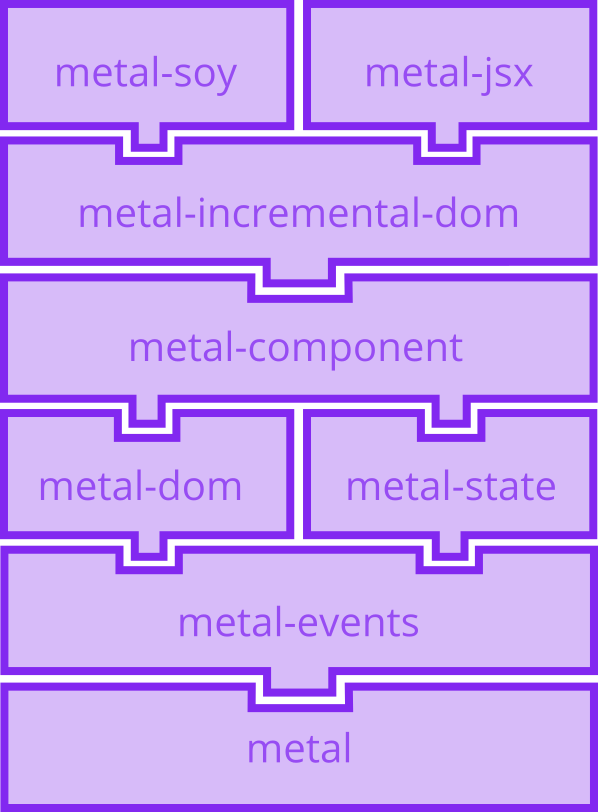

# Metal.js

Before starting make sure to clone the [metal/metal.js](https://github.com/metal/metal.js) repo and follow its [setup instructions](https://github.com/metal/metal.js#setup).

## Monorepo organization (Lerna)

This repository contains multiple packages, which are considered the core modules. They're published separately in npm, as developers are not required to use all of them on their projects. There's a lot of communication between them though, and new features or even improvements often require changes on more than one of these modules, which is hard to do and test when code is split into separate repos.

That's why we've decided to use [LernaJS](https://lernajs.io/) to manage the
repo. It's perfect for this use case and it's been used by
[projects like Babel and React](https://lernajs.io/#users).

## Packages

The main repo currently has eight packages:

* [metal](http://npmjs.com/package/metal) - Utility functions.
* [metal-events](http://npmjs.com/package/metal-events) - Custom event handling.
* [metal-dom](http://npmjs.com/package/metal-dom) - DOM related utilities.
* [metal-state](http://npmjs.com/package/metal-state) - Data configuration and tracking.
* [metal-component](http://npmjs.com/package/metal-component) - Basic component structure.
* [metal-incremental-dom](http://npmjs.com/package/metal-incremental-dom) - Integration with incremental dom.
* [metal-soy](http://npmjs.com/package/metal-soy) - Integration with soy templates.
* [metal-jsx](http://npmjs.com/package/metal-jsx) - Integration with JSX templates.

The diagram below represents the relations between them. You can see for example that **metal** is the most low level package, while **metal-jsx** and **metal-soy** are both built on top of the incremental dom integration:

Each package has its own package.json and is set up so that it provides two
types of entry points: one for commonjs usage (**main**) and another for ES6
modules (**jsnext:main**). Check out metal-dom's
[package.json](https://github.com/metal/metal.js/blob/master/packages/metal-dom/package.json#L11) file as an example.

## Contributing

For detailed information about the workflow used to develop for Metal.js (like building and testing), as well as contribution requirements, check out the [guidelines document](https://github.com/metal/metal.js/blob/master/CONTRIBUTING.md).

## Next steps

Let's start actually looking at the code now. We'll begin with the simplest package: **metal**.

[↪ Package: metal](metal.js/metal.md)
